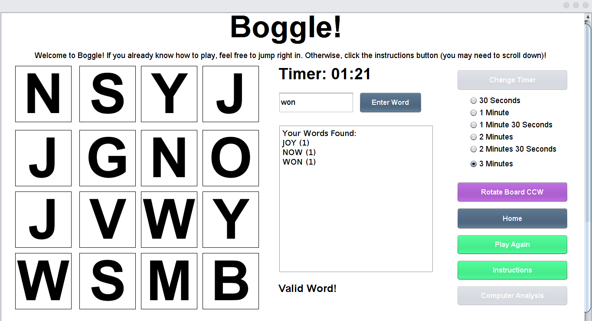
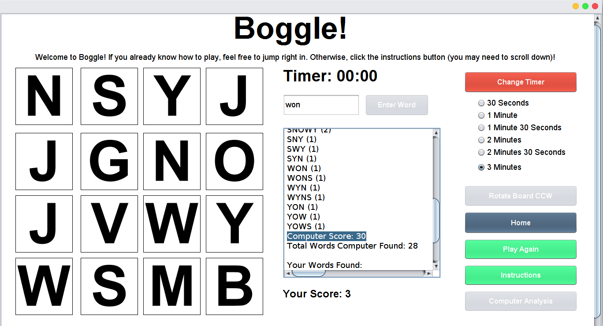

# Efficient-Algorithmic-Java-GUI-Boggle-Solver-And-Game
This is a project I created for my ICS4UO final assessment. It replicates the famous Boggle word game through a GUI. However, in addition to playing Boggle, it also has a Boggle Solver feature. As the name suggests, given a Boggle board, this feature can find all possible word combinations. In order to challenge myself I tried to make it as efficient as possible, so I ended up using Tries and a customised Flood-Fill Search method.

To run the program, download the jar file (your local browser may ask to discard the file for safety reasons since it is a .jar file, but I assure you its safe). Then, run it. The exact method to run depends on your local operating system, but on ubuntu through terminal you can go to the directory the jar file is downloaded, then run the following command:

```shell
java -jar Boggle.jar
```

To view source files, look in the src folder in this repository. The stars of this show are the Trie.java and the BoggleGame.java files, which contain the bulk of the algorithms. Note that GUI code is typically handled at the top of the file, while algorithmic code is closer to the bottom. All files have been thoroughly commented/documented.


Screenshots from the game:



